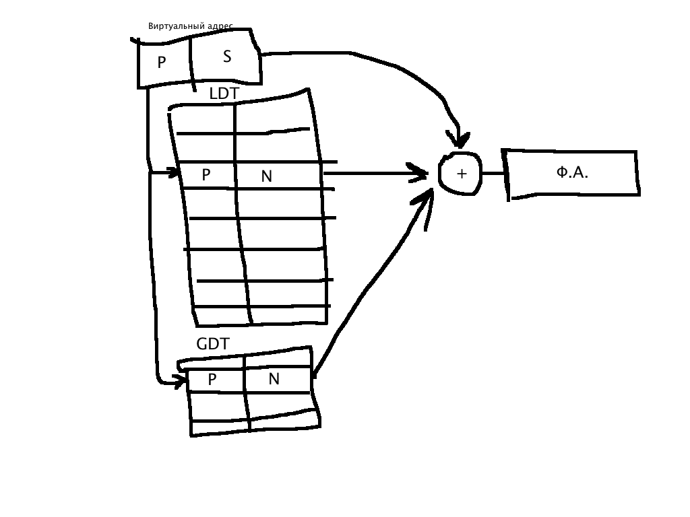

Управление памятью ОС
=====================

Типы адресов
------------

Три типа адресов:

1. Символьные - присваивает пользователь при написании программы на алгоритмичеком языке программирования либо ассемблере. К ним относятся имена переменных, имена функций и меток.

2. Виртуальные - вырабатывает транслятор, переводящий программу на машинный язык. Т.к. во время трансляции чаще всего неизвестно в какую область оперативной памяти будет загружена программа, то транслятор присваивает переменным и функциям виртуальные адреса (условные адреса), считая по умолчанию, что программа будет размещена с нулевого адреса.

   Совокупность виртуальных адресов процесса называется **виртуальным адресным пространством**. У каждого процесса собственное виртуальное адресное пространство, которое ограничено разрядностью архитектуры компьютера.

3. Физические - соответствует номерам ячеек оперативной памяти в которые действительно загружены данные.

   В некоторых случаях (в специализированных системах), когда заранее точно известно в какой области оперативной памяти будет выполняться программа, транслятор выдает исполняемый код сразу в физических адресах.

Существует два способа преобразования виртуальных адресов в физические:

1. Перемещающий загрузчик
             
            0       0E      1C
            -------------------------
            |     | a |   | b |     |                      - виртуальные адреса в программе
            -------------------------
            \     \   \   \   \      \
        ------------------------------------------
        |     |     | a |   | b |      |         |         - оперативная память
        ------------------------------------------
        0    038A    038A+   038A+
                     0E      0C     
               
   Перемещающий загрузчик на основании имеющихся у него исходных данных о начальном адресе физической памяти в который предстоит загружать программы и информация, предоставленная транслятором об адресно-зависимых константах программы выполняет загрузку программы в память, совмещая ее с заменой виртуальных адресов физическими.    
 
2. Динамическое преобразование      

            0       0E      1C
            -------------------------
            |     | a |   | b |     |                      - виртуальные адреса в программе
            -------------------------
            \     \   \   \   \      \
        ------------------------------------------
        |     |     | a |   | b |      |         |         - оперативная память
        ------------------------------------------
        0    038A     
  
   Программа загружается в оперативную память в неизменном виде в виртуальных адресах. Во время выполнения программы при каждом обращении к оперативной памяти происходит преобразование виртуального адреса в физический. Метод позволяет перемещать программу в оперативной памяти, в то же время расход на перерасчет виртуальных адресов в физические растет.
   
Понятие виртуальной памяти
--------------------------

Механизмы виртуальной памяти:

1. Overlay. Программист при написании программы с помощью транслятора разбивал процесс на части, называемые оверлеями (overlays), указывал порядок вызова оверлея и параметры, необходимые для передачи из одного оверлея в другой.

2. Swapping. Процесс переноса задачи целиком из оперативной памяти на жесткий диск и обратно.

3. **Виртуальная память** - совокупность программно-апаратных средств позволяющих пользователю писать программы, размер которых превосходит имеющуюся оперативную память. Для этого она решает следующие задачи:
    
    * Размещает данные в запоминающих устройствах различного типа.
    * Перемещает по мере необходимости данные между запоминающими устройствами разного типа
    * Преобразует виртуальные адреса в физические (процессор)

Классификация методов управления памятью
----------------------------------------

1. ###Без использования внешней памяти 

   * ####С фиксированными разделами
   
     Вся оперативная память делится на разделы фиксированного размера в момент установки ОС либо ее загрузки. В один раздел может быть загружен только один процесс
     
               --------------     -----
               | ОС | 1 | 2 | ... | n |  - оперативная память, n разделов = n процессов
               --------------     -----  
                                 
     Процесс, запущенный на выполнение добавляется в очередь процессов, которая может быть общей или персональной для каждого раздела памяти. Для преобразования виртуальных адресов в физический используется перемещающий загрузчик, потому что процесс загружался в память один раз (и навсегда (: )
     
     Недостатки:
     
       * Жесткость: сколько разделов - столько процессов (не больше)
       * Процесс, не помещающийся ни в одном из разделов не может быть выполнен
       * Неэффективное использование: процесс не занимает память на 100%
       
     Преимущества:
       
       * Простота реализации
   
   * ####С динамическими разделами 
     
               -------------------
               | ОС |            |  - оперативная память в момент загрузки ОС
               -------------------   

               ------------------     --------- 
               | ОС | П1 | П2   | ... | Пn    |  - оперативная память в момент выполнения процессов (у каждого процесса свой объем памяти)
               ------------------     ---------     
     
               ----------------------     --------------- 
               | ОС | П1 |\\\| П2   | ... |\\\\\| Пn    |  - оперативная память после некоторого времени выполнения процессов,
               ----------------------     ---------------    фрагментированные области - |\\\|  
     
     После загрузки ОС вся память является свободной (не разбитой на разделы). Каждому вновь поступившему на выполнение процессу выделяется столько памяти, сколько ему необходимо.
     
     Недостатки:
     
       * **Фрагментация** - наличие большого числа несмежных участков памяти маленького размера.
       
     Преимущества:
      
       * Количество одновременно запущенных процессов зависит от общего количества памяти и размера памяти процессов (увеличивается уровень мультипрограммирования)
       
     Задачи, которые выполняет ОС в данном методе:  
     
       1. Ведение таблиц свободных и занятых областей памяти
       2. При поступлении нового процесса анализ требований к оперативной памяти, выбор свободного раздела, загрузка в раздел процесса и корректировка таблиц свободных и занятых областей. 
       3. (При завершении процесса) Корректировка таблиц свободных и занятых областей                                 
     
   * ####С перемещающими разделами 
   
     В начале работает также как и метод с динамическими разделами. В определенное время (по расписанию или при нехватке памяти) происходит **дефрагментация разделов** - сдвиг занятых разделов в сторону старших или младших адресов.               
   
2. ###С использованием внешней памяти

   * ####Страничное распределение памяти
      
      **Страница** - непрерывная последовательность адресов, лежащая в заданном диапазоне фиксированного размера равного степени двойки. Размер страница выбирается из размера имеющейся оперативной памяти и типа операционной системы. Процесс делится на страницы в момент запуска на выполнение и создается служебная структура называемая *таблица страниц процесса*. Для каждого процесса существует своя таблица страниц.
      
      При загрузке процесса часть его виртуальных страниц помещается в оперативную память, а остальные - на диск. Смежные виртуальные страницы не обязательно располагаются в смежных физических страницах. Страницы не загруженные в память могут находится в файле подкачки или в исходном исполняемом файле. Таблица страниц содержит следующую служебную информациюо страницах процесса: номер виртуальной страницы, номер физической страницы, признак присутствия в оперативной памяти, права доступа к странице, признак чтения/записи страницы, признак выгружаемости страницы, признак модификации.
      
      При каждом обращении к памяти происходит чтение из таблицы страниц информации о виртуальной странице, к которой произошло обращение. Если данные виртуальной страницы находятся в оперативной памяти, то выполняется преобразование виртуального адреса в физический. Если же виртуальная страница в данный момент выгружена на диск, то происходит страничное прерывание, выполняющийся процесс приостанавливается и активизируется другой процесс. Программа обработки страничного проерывания находит на диске требуемую виртуальную страницу и пытается загрузить ее в оперативную память. Если в памяти имеется свободная физическая страница, то загрузка происходит немедленно; если же свободных страниц нет, то решается вопрос, какую страницу следует выгрузить из оперативной памяти.
      
      Критерии выбора страниц для выгрузки:
      
        1. Дольше всего неиспользовавшая страница
        2. Первая попавшаяся страница
        3. Страница к которой в последнее время было меньше всего обращений
        
      В некоторых системах используется понятие **рабочего множества страниц** - страницы, которые чаще всего используются в процессе. После того, как выбрана страница, которая должна покинуть оперативную память, анализируется признак модификации: если вытесняемая страница с момента загрузки была модифицирована, то ее новая версия переносится на диск; если же нет, то содержимое может быть просто уничтожено.
      
                  Виртуальный
                     адрес
                 -------------
              -  |  P  |  S  | ------
             |   -------------       |
             |                       |
             |                       |
             |     Таблица           |
             |     страниц           |
             |   -------------       |
             |   -------------       |
             |   -------------       |
              -  |  P  |  N  |  -    |
                 -------------   |   |
                 -------------   |   |
                                 |   |
              -------------------    |
             |     Физический        |
             |       адрес           |
             |   -------------       |
              -  |  N  |  S  | ------
                 -------------
       
            P - номер виртуальной страницы   N - номер физической страницы
            S - cмещение в пределах виртуальной страницы
    
      При каждом обращении к виртуаьной памяти аппаратными средствами выполняется следующее действие: на основании начального адреса таблицы страниц, номера виртуальной страницы, длины записи в таблице страниц определяется адрес нужной записи в таблице, извлекается адрес физической страницы, к этому номеру присоединяется смещение.
    
      На производительность системы со страничной организацией памяти влияет страничное прерывание.
    
      Преимущества:
      
        1. Самое быстрое преобразование виртуального адреса в физический.
        2. Отсутствие фрагментации
      
      Недостатки:
    
        1. Неэффективное использование памяти - чем больше процессор, тем больше неиспользуемых страниц.
        2. В одной странице хранятся и данные, и код программы

   * ####Сегментное распределение памяти
   
      **Сегмент** - непрерывная последовательность адресов, лежащих в заданном диапазоне переменного размера. Разбиение процесса на сегменты происходит в момент трансляции программы в машинный код.
      
      Виды сегментов: сегмент кода, сегмент данных, сегмент стека.  
      
      Разбиение процесса на смысловые части - сегменты -  позволяет дифференцировать права доступа к сегментам путем ограничения инструкций процессора, возможных для работы с данным сегментом. Сегмент кода, содрежащий какую-либо функцию может быть доступен различным процессам. При запуске процесса на выполнение ОС создает специальную информационную структуру, которая называется *таблица сегментов*, которая содержит описание всех сегментов текущего процесса: номер сегмента, физический адрес начала сегмента, предел (размер) сегмента, тип сегмента, признак присутствия сегмента, признак модификации, права доступа к сегменту, чтение/запись сегмента. Часть сегментов загружается в оперативную память, а часть остается на диске. при каждом обращении к оперативной памяти происходит обращение к таблице сегментов для преобразования виртуального адреса в физический. Если сегмент не загружен в память, то происходит сегментное прерывание - процесс приостанавливается и запускается другой процесс.
      
       
      
      Каждый процесс имеет доступ к двум таблицам сегмента: LDT - локальная дескрипторная таблица, содержащая описание сегментов текущего процесса; GDT - глобальная дескрипторная таблица, содержащая описание сегментов ядра ОС. На основании номер виртуального адреса находится запись в таблице сегментов и из нее извлекается физический адрес начала сегмента, к которому прибавляется смещение - получается физический адрес.
      
      Преимущества:
      
        1. Дифференцированные права доступа к сегментам
        2. Один и тот же сегмент кода может быть использован различными процессами
      
      Недостатки:
      
        1. Медленное преобразование адреса по сравнению со страничным
        2. Появляется фрагментация памяти
      
   * ####Сегментно-страничное распределение памяти

      При странично-сегментной организации памяти процесс делится на сегменты в момент трансляции(все теже 3 вида сегментов), сегмент делится на страницы в момент запуска процесса на выполнение. 

      При сегментно-страничной организации памяти, создается 2 информационные структуры:
          1) Таблица сегментов
          2) Таблица страниц сегмента.

      Загрузка процесса выполняется постранично.

      ВА - виртуальный адрес

              ВА
      -------------------
      |  N  |  P  |  S  |
      -------------------
      |
      |
      |   ------
          |....|
          ------
          | N  |
          ------
          |....|
          ------

      Виртуальный адрес при сегментно-страничной организации памяти состоит из 3х частей:
          1) Номер сегмента
          2) Номер виртуальной страницы
          3) S - Смещение внутри виртуальной страницы

      При каждом обращении к памяти аппаратными средствами выполняется:
          1) В таблице сегментов находится нужная запись. В которой хранится:
              * Тип сегмента
              * Права доступа сегмента
              * И физический адрес таблицы страниц сегмента

          2) Из записи извлекается физический адрес таблицы страниц, в которой находится соответсвие между виртуальной и физической страницей, кроме этих 2х полей присутсвует еще:
              * Признак присутвия
              * Признак модификации
          
          3) Использую номер физической страницы, к операции конкатенации добавлятся смещение внутри страницы, получается физический адрес.

      (!)     В данном методе отсутвует сегментное прерывание. 

      Недостатки:
          1) Самое медленное преобразование виртуального адреса в физический.
          2) Неэффективное использование памяти в последних страницах сегмента.

      Преимущесва обьединяют все преимущества страничных и сегментного способа организации памяти.

      Вывод: 
          Все современные процессоры используют только странично-сегментную организацию памяти.

*** Принцип кеширования данных

    Кеш - это способ организации совместного функционирования двух типов запоминающих устройств, который позволяет Уменьшить среднее время доступа за счет динамического копирования наиболее часто используемой информации.

    |               ------                  /\
    |               | РП |                  |
    |           ----------------            |   время
    |           |     СВЗУ     |            |   доступа
$   |       ------------------------        |
    |       |          ОП           |       |
    |   ---------------------------------   |
    |   |              ДУ               |   |
    .   ---------------------------------
    \/

    РП      - Регистры Процессора
    СВЗУ    - СверхОперативное Запоминающее Устройство
    ОП      - Оперативная Память
    ДУ      - Дисковое Устройство

    ---------    <        Медленный канал передачи данных    >      ---------
    |   ЦП  |     ===========================================       |   ОП  |
    ---------    >                                           <      ---------
        /\
        |
        |
        |
        \/
    ---------
    |  СОЗУ |
    ---------

    *Это частный случай использования кеш-памяти для уменьшения среднего времени доступа к данным, хранящимся в оперативной памяти

    Если наша оперативная память адресованная, то кеш память *не адресуемма*, поэтому в кеш памяти хранится следущая информационная структура:
        
    -----------------------------------------------------------------------------------------------    
    |Физический Адрес| Данные | Доп. Информация|
                              | Пр. Мод. | ПО  |
    |:---------------|:-------|:---------|:----|
    
    

    Каждый запрос к оперативной памяти выполняется по следущему алгоритму:
        1) проРассматривается содержимое кеш памяти с целью определения, не находятся там ли нужные нам данные
        2) Если данные обнаружены, то они считываются и передаются в процессор(признак обращения изменяется)
        3) Если нужных данных - нет, то они вместе со своим адресом копируются из оперативной памяти в кеш-память. Если в кеш памяти нет свободного места, то выбираются данные к которым в последний период было меньше всего обращений(для вытеснения)
        4) Если вытесняемые данные были модифицированы, то они переписываются в оперативную память, если не были модифицированы, то кеш-память помечается как свободная.
        5) На практике, в кеш-память вмещается не один элемент данных, а блок связанных адресов.
        6) Для определения вероятности кеширования данных используется 2 принципа:
            1) Принцип пространственной локальности
                Если произошло обращение, по некоторому адресу, то с высокой степени вероятности в ближайщее время произойдет обращение к соседним адресам
            2) Временная локальность 
                Если произошло обращение по некоторому адресу, то следующее обращение по этому же адресу произойдет в ближайщее время.

