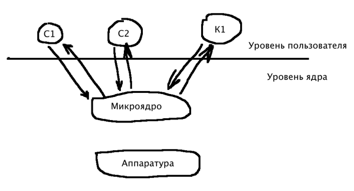

Принципы построения операционных систем
=======================================

Монолитный системы
------------------
  
В монолитных ОС нету никакой структуры. ОС написана как набор процедур, каждая из которых может вызывать другие процедуры. Каждая процедура системы имеет хорошо определенный интерфейс, терменов, параметров и результатов, и может вызывать другую, для выполнения нужной или полезной, для нее работы. Появились структурированные монолитные системы, в которых начали выделять главную функцию(процедуру), которая взаимодействовала с аппаратурой компьютера, сервисные процедуры(выполняет полезуню работу для интерфейса и других сервисных процедур). Новая структура позволила повысить надежность операционной системы, за счет вынесения аппаратно зависимого кода в одну процедуру.

Многоуровневые операционные системы
-----------------------------------

Операционная система "THE" имела 6 уровней:
    
  1. Нулевой уровень занимался распределением процессорного времени, переключал процессы по прерыванию или по истечению времени
  2. Первый уровень управлял оперативной памятью
  3. Второй уровень - взаимосвязь между консолью оператора и процессами
  4. Третий управлял устройствами ввода-вывода, буферизировал потоки информации от них и к ним. Предоставлял некоторое абстрактное устройство ввода-вывода, скрывая особенности каждого, делал его более удобным для пользователя
  5. Четвертый - на этом уровне работали пользовательские программы
  6. Пятый - а этом уровне размещался процесс системного администрирования(администратора)

Уровни немогли вызывать функции за пределами своего уровня, к примеру, чтобы 5му уровню вызвать функцию 0го уровня, приходилось вызывать 4,3,2 и т.д.

Микроядро, или клиент-серверная архитектура
-------------------------------------------

**Микроядерная архитектура ядра** - это монолитное структурированное ядро в котором выделяют программный компонент "клиент" - потребителя какого-либо сервиса/услуги - и программный компонент "сервера" - поставщика услуги/сервиса. Взаимодействие между клиентом и сервером стандартизируется таким образом, что сервер может обслуживать клиентов, реализованных различными способами и различыми производителями. Один и тот же компонент может быть клиентом к одному виду услуг и сервером к другому виду.

Операционную систему разбивают на несколько серверов, каждый из которых выполняет отдельный набор сервисных функций (диспетчер памяти, ввод/вывод). Каждый сервер выполняется в пользовательском режиме. Клиент запрашивает сервис, посылая сообщение серверу. Доставку сообщения выполняет микроядро. Сервер выполняет запрошенную операцию, после чего ядро возвращает результат клиенту с помощью другого сообщения. Микроядро реализует жизненно важные функции ОС (управление аппаратурой, пересылка сообщений и т.д.). 

Классическая реализация микроядра является очень медленной по быстродействию и конкретные разработчики ядра для повышения быстродействия расширяют функции микроядра, например Windows NT в микроядро включили функции управления оперативной памятью, процессами, файловыми системами, прерываниями и устройствами ввода-вывода.

Объектно-ориентированное ядро
-----------------------------

**Объект** - единица программ и данных, взаимодействующая с другими объектами посредством приема и передачи сообщений. Объектом может быть конкретный элемент ОС (окошечко, кнопочка, документик) либо абстрактный элемент (событие, процесс). Функции объекта определяют перечень действий, которые могут быть выполнены над данными этого объекта.

