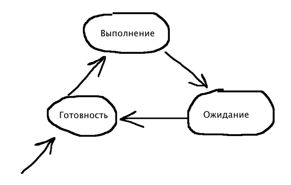

Управление процессами
=====================

**Процесс** - некоторая абстракция, описывающая выполняющуюся программу. Для ОС процесс - это единица работы, заявка на потребление системных ресурсов. Подсистема управления процессами планирует выполнение процессов, т.е. распределяет процессорное время между несколькими одновременно существующими в системе процессами, а также занимается созданием и уничтожением процессов, обеспечивает процессы необходимыми системными ресурсами, поддерживает взаимодействие между процессами.

Состояние процессов
-------------------

В многозадачной системе процесс может находиться в одном из трех состояний:
  
  1. Выполнение - активное состояние процесса, во время которого процесс обладает всеми необходимыми ресурсами и непосредственно выполняется процессором.
  2. Ожидание - пассивное состояние, процесс заблокирован, не может выполняться по своим внутренним причинам - он ждет осуществление некоторого события, получения сообщения и т.д.
  3. Готовность - пассивное состояние процесса; процесс заблокирован всвязи с внешними (по отношению к нему) обстоятельствами - процессор занят выполнением другого процесса.
  
  
  
Контекст и дескриптор процесса
------------------------------

На протяжении существования процесса его выполнение может быть многократно прервано и продолжено. Для того, чтобы возобновить выполнение процесса необходимо восстановить состояние его операционной среды (состояние регистров процессора, программного счетчика, режима работы процессора, указателей на открытые файлы, информации о незавершенных операциях ввода/вывода, системных вызовов и т.д.). Вся вышеназванная информация называется **контекстом процесса**. 

Для реализации планирования процессов требуется дополнительная информация: идентификатор процесса, состояние процесса, данные о степени привиллегированности процесса, место нахождения сегмента процесса - все это называется **дескриптором процесса**. 

Очередь процессов представляет из себя дескрипторы отдельных процессов, объединенных в списки.

Алгоритмы планирования процессов
--------------------------------

Планирование процесса включает в себя решение трех задач:

  1. Определение момента времени для смены выполняемого процесса
  2. Выбор процесса на выполнение из очереди готовых процессов
  3. Переключение контекста старого и нового процессов
  
Первые две задачи решаются программными средствами, третья - аппаратными.

Существуют две группы алгоритмов: алгоритмы, основанные на *квантовании* и алгоритмы основанные на *приоритетах*.

**Приоритет** - число, характеризующее степень привиллегированности процесса при использовании ресурсов вычислительной машины. Приоритет может быть целым, дробным, положительным или отрицательным числом. Приоритет может назначаться директивно администратором системы - *статический приоритет*, либо вычисляться ОС по некоторым правилам и изменяться во время жизни процесса - *динамический приоритет*. Приоритеты бывают *относительные* и  *абсолютные*. В обоих случаях выбор процесса на выполнение из очереди готовых осуществляется одинаково - выбирается процесс, имеющий наивысший приоритет. В системах с относительными приоритетами активный процесс выполняется до тех пор, пока сам не покинет процессор, уйдя в состояние ожидания; в системах с абсолютными приоритетами выполнение активного процесса прерывается еще при одном условии - если в очереди готовых процессов появился процесс с приоритетом больше, чем у активного процесса.

**Квант** - единица времени, выделяемая процессором для выполнения процессов. Кванты могут быть одинаковыми для всех процессов или различными; могут быть фиксированными или могут изменяться в различные периоды жизни процесса. При квантовании процесс выполняется до тех пор, пока не завершится выделенный ему квант времени. Выбор процесса на выполнение при квантовании происходит по принципу FIFO, либо LIFO.

Современные ОС используют алгоритм планирования, построенный как на квантовании, так и на приоритетах, например Windows NT использует абсолютные динамические приоритеты с квантованием.

Вытесняющие и невытесняющие алгоритмы планирования
--------------------------------------------------
*** Вытесняющая и невытесняющая многозадачность.
    Это процедуры планирования. 

    *Не вытесняющая многозадачность:
        Это способ планирования при котором активный процесс выполняется до тех пор, пока сам по собственной инициативе не отдаст управление планировщику Операционной Системы. 

    *Вытесняющая пногозадачность:
        Это такой способ, при котором решение о переключение процесорра с выполнения одного процесса на другой процесс принимается планировщиком Операционной Системы. 

    Относительные и абсолютные приоритеты не тоже самое что и вытесеящая и не вытесняющая многозадачность. 

    *Различия*: это степень централизации механизма планирования задач. 

    При вытесняющей многозадачность механизм планирования целиком сосредоточен в ОС. И программист пишет свое приложение не заботясь о том как оно будет выполнятся паралльельно с другими задачами. 

    При невытесняющей многозадачности механизм планирования распределен между Операционной Системой и прикладными программами. Прикладная программа получив управление от Операционной Системы сама определяет момент завершения своей очередной итерации и передает управление ОС с помощью какого-либо системного вызова. 

*** Потоки(нити)

    *Поток - это разбиение процесса Операционной Системы на внутренние единицы работы. 

    При использовании многопоточности, Операционная Система планирует не процессы, а потоки.

    Потоки обладают:
        * Состоянием
        * Дескриптором

    Все потоки одного процесса обладают общим контекстом и каждый поток обладает еще собственным контекстом. В общий контекст попадает все виртуальное адресное пространство процесса, незавершенные операции I\O, указатели на открытые файлы, и т.д. 

    Персональному контексту относится значение регистров процессора и проргаммного счетчика.

    Каждый поток может планироваться самостоятельно, поэтому у каждого потока свой собственный дескриптор. 

*** Семафоры

    *Семафор* - это системная блокирущая переменная, которая может принимать целое не отрицательное значение. 

    Семафор существует в Операционной Системе, только то время существования процесса которые его используют. 

    Семафоры использбются:
        * Для увеличения на 1
        * Для уменьшения на 1
        * Для получения его состояния

    Применение: 
        * Классическое применение: Пул.

                                   Пул
        -------------         -------------
        | Писатель  |--|      |           |
        -------------   \     |           |         -------------
                         |    |-----------|      -> | Читаталь  |
                         |    |           |   --/   -------------
                          ->  |           | -/
                              |-----------|

    Семафор не блокирует доступ к ресурсу. Он сигнализирует потокам, что что-то произошло. 

    Недостаток заключается в том что все потоки\процессы должны использовать о дин  и тот же семафор, поэтому есть мьютексы.

*** Мьютексы

    Это семафор, который принимает двоичное значение(0\1). Мьютекс, чаще всего привязывают к какому либо ресурсу, например к файлу. 
    Значение мьютекса регулирует доступ к файлу других процессов. 
    Сигнальное состояние это не нулевое, оно блокирует доступ к ресурсу
    Не сигнальное разрешает доступ.

    Отличие от семафора: Мьютекс существует до его удаления из системы. Поможет либо перезагрузка, либо его корректное удаление.

*** Критическая Секция
    *Критическая секция* - это часть программы, в которой есть обращение к совместно используемым данным. 

    Это часть программы, выполнения которой прерывать невозможно никакими средствами. 

    Критические секции должны быть маленькие, быстро выполняемые, так как при неправильном написании кода даже ОС не сможет завершить его выплонения.

    Чаще всего используюется при динамическом программировании, либо при сетевой программировании.

